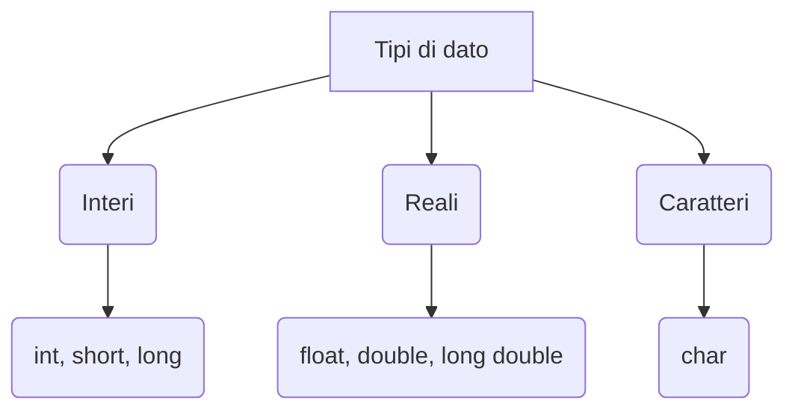

# La programmazione in C

---

# Sommario

- L'ambiente online Replit
- La struttura di base dei programmi in C
- I tipi di dati fondamentali
- Variabili
- Costanti

---

# L'ambiente online Replit


<style>
 img{
  margin: auto;
  width: 90%;
 } 

</style>

---

# La struttura di base dei programmi in C

L'esempio mostra la struttura di un tipico programma in C.

L'istruzione <code>int main(void)</code> dichiara una funzione che non è di una libreria: infatti **main** è la funzione principale, che dev'essere presente in ogni programma in C.

```c {all|3,4,13|5-7|9-10|12|1|all}
#include <stdio.h>

int main(void) 
{ 
  int eta; 
  char pokemon[] = "Bulbasaur";
  eta = 6;

  printf("Il mio pokemon preferito è: %s", pokemon);
  printf(", da quando avevo %d anni.\n", eta);

  return 0;
}
```
---
clicks: 3
---

# La struttura di base dei programmi in C
Un programma si compone di tre parti fondamentali:

<div class="flex">
  <div class="basis-1/2">

```c {all|1|3,4,13|5-12}
  #include <stdio.h>

  int main(void) 
  { 
    int eta;  
    char pokemon[] = "Bulbasaur";
    eta = 6;

    printf("Il mio pokemon preferito è: %s", pokemon);
    printf(", da quando avevo %d anni.\n", eta);

    return 0;
  }
```
  </div>
  <div class="basis-1/2">
      <ol class="mx-8">
        <li v-click="1">Librerie</li>
        <li v-click="2">Main</li>
        <li v-click="3">Corpo del programma</li>
      </ol>
  </div>
</div>

Ogni istruzione deve terminare con il punto e virgola (;).

---

# I tipi di dati fondamentali


<div class="flex">
  <div class="basis-1/4">
  </div>
  <div class="basis-2/4 my-8">


  </div>
  <div class="basis-1/4">
  </div>

</div>

---

# Interi


  <div>
    <h3 class="pb-6"> con segno (signed)</h3>
    <table class="table-auto border-spacing-4">
      <thead class="bg-indigo-500 text-white">
        <tr>
          <th>Tipo</th>
          <th>N° bit</th>
          <th>Minimo</th>
          <th>Massimo</th>
        </tr>
      </thead>
      <tbody>
        <tr>
          <td class="font-semibold">short</td>
          <td>16</td>
          <td>-32 768</td>
          <td>+32 767</td>
        </tr>
        <tr>
          <td class="font-semibold">int</td>
          <td>32</td>
          <td>-2 147 483 648</td>
          <td>+2 147 483 647</td>
        </tr>
        <tr>
          <td class="font-semibold">long</td>
          <td>64</td>
          <td>-9.223372e+18</td>
          <td>+9.223372e+18</td>
        </tr>
      </tbody>
    </table>
  </div>


---

# Interi
<div>
    <h3 class="pb-6"> senza segno (unsigned)</h3>
    <table class="table-auto border-spacing-4">
      <thead class="bg-indigo-500 text-white">
        <tr>
          <th>Tipo</th>
          <th>N° bit</th>
          <th>Minimo</th>
          <th>Massimo</th>
        </tr>
      </thead>
      <tbody>
        <tr>
          <td class="font-semibold">unsigned short</td>
          <td>16</td>
          <td>0</td>
          <td>65 5365</td>
        </tr>
        <tr>
          <td class="font-semibold">unsigned int</td>
          <td>32</td>
          <td>0</td>
          <td>4 294 967 295</td>
        </tr>
        <tr>
          <td class="font-semibold">unsigned long</td>
          <td>64</td>
          <td>0</td>
          <td>circa 1.84e+19</td>
        </tr>
      </tbody>
    </table>
</div>

---

# Reali

<div>
    <h3 class="pb-6"> senza segno (unsigned)</h3>
    <table class="table-auto border-spacing-4">
      <thead class="bg-indigo-500 text-white">
        <tr>
          <th>Tipo</th>
          <th>N° bit</th>
          <th>Cifre significative</th>
        </tr>
      </thead>
      <tbody>
        <tr>
          <td class="font-semibold">float</td>
          <td>32</td>
          <td>6-7</td>        
        </tr>
        <tr>
          <td class="font-semibold">double</td>
          <td>64</td>
          <td>15-16</td>
        </tr>
        <tr>
          <td class="font-semibold">long double</td>
          <td>128</td>
          <td>?</td>
        </tr>
      </tbody>
    </table>
</div>

---

# Caratteri

<p>Una variabile <code>char</code> occupa 8 bit di memoria.</p>


<style>
 img{
  margin: auto;
  width: 80%;
 } 

</style>


---

 # Caratteri

```c
#include <stdio.h>

int main(void) 
{
  char var1 = 'A';
  char var2 = 65;

  printf("Le due variabili hanno lo stesso contenuto!\n");
  printf("Contenuto di var1: %c\n", var1);
  printf("Contenuto di var2: %c\n", var2);
    
  return 0;
}
```

---

# Variabili

Una variabile è un'area di memoria nella RAM caratterizzata da:

- tipo
- nome (*identificatore*)

**Dichiarazione**

Per poter utilizzare una variabile è necessario dichiararla, ovvero comunicare al compilatore che si intende utilizzare un dato di un certo tipo.
```c
int numero, x, y;
float temperatura;
char car;
```

**Inizializzazione**

All'atto della dichiarazione, è possibile assegnare un valore alle variabili. (consigliato)
```c
int numero, x = 0, y = 0;
```

---

# Variabili

Altre operazioni:

**Assegnazione di un valore** 
```c
numero = 666; 🤟😈
```

**Assegnazione di una variabile** 
```c
numero = x;
```


**Assegnazione di un'espressione** 
```c
numero = 666 / 2;
y = numero + x;
```

È possibile eseguire operazioni arimetiche solo tra *variabili dello stesso tipo*, altrimenti il compilatore ci segnalerà un errore (studieremo più avanti alcune eccezioni!).

---

# Identificatori

Alcune regole da rispettare per scegliere i nomi delle variabili/costanti.

**Un identificatore può essere composto da**:

- lettere maiuscole e minuscole
- numeri
- simbolo di underscore

```c
Pippo, x1, x2, mano_dx, mano_sx ✅
```
<br>
<hr>

**Un identificatore non può**:

- iniziare con un numero
- essere una parola chiave del linguaggio C (es: main, return ...)


```c
10_x, main, return, ❌
```

Il linguaggio C è sensibile alle maiuscole/minuscole, quindi l'identificatore <code>id</code> è diverso da <code>ID</code>.

---

# Calcolo dell'area di un rettangolo

```c
#include <stdio.h>

int main(void) 
{
  float area;
  float base;
  float altezza;

  base = 3;
  altezza = 5;
  area = base * altezza;
  
  printf("Area rettangolo: %f\n", area);
    
  return 0;
}
```

---
clicks: 6
---

# Cenni sulla funzione printf

Ci permette di comunicare in output (sulla console) i risultati dell'elaborazione.

<div class="flex">
  <div class="basis-1/2">

```c {all|9|10|11|12|13|all}
#include <stdio.h>

int main(void) 
{
  int i = 2;
  float r = 7.8;
  char car = '@';

  printf("Questa è una stringa 123@! \n");
  printf("Numero intero: %d \n", i);
  printf("Numero reale: %f \n", r);
  printf("Nome: %s \n", "Salvo");
  printf("Carattere: %c \n", car);
  
  
  return 0;
}
```
  </div>
  <div class="basis-1/2">
    <ul style="list-style: none;" class=" mx-8 ">
      <li v-click="1">stringa di caratteri</li>
      <li v-click="2"><strong>%d</strong> per stampare un intero</li>
      <li v-click="3"><strong>%f</strong> per stampare un reale</li>
      <li v-click="4"><strong>%c</strong> per stampare un carattere</li>
      <li v-click="5"><strong>%s</strong> per stampare una stringa</li>
      <li v-click="6"><strong>\n</strong> per andare a capo</li>
    </ul>
  </div>
</div>

---

# Scambio di variabili

```c
int main(void) 
{
  float a = 3;
  float b = 5;
  float temp;
  
  printf("Valore a prima: %f \n", a);
  printf("Valore b prima: %f \n", b);
  
  temp = a;
  a = b;
  b = temp;
  
  printf("Valore a dopo: %f \n", a);
  printf("Valore b dopo: %f \n", b);
  
  return 0;
}

```
---

# Costanti

Una costante è un'area di memoria nella RAM che identifica dati che **non possono essere modificati**.

Nel linguaggio C esistono due modi per definire una costante:
- attraverso la parola chiave `const`
- attraverso la direttiva al preprocessore `#define`

Nel primo caso, la costante viene vista come una "variabile con valore fisso".

Nel secondo caso, il compilatore sostituirà a tutte le occorrenze dell'identificatore il valore associato, senza che vi sia alcuna locazione di memoria associata alla costante.

---
clicks: 2
---

# Area del cerchio

<div class="flex">
  <div class="basis-1/2">

```c {all|5|all}
#include <stdio.h>

int main(void) 
{
  const float PIGRECO = 3.1415;
  float raggio = 5;
  float area;
  
  area = raggio * raggio * pigreco;
  printf("Area del cerchio: %f \n", area);

  return 0;
}
```
  </div>
  <div class="basis-1/2">
    <ul style="list-style: none;" class=" mx-8 ">
      <li v-click="1"><strong>const</strong> per definire una costante</li>
      <li v-click="1"><p>convenzione: costanti con identificatori maiuscoli</p></li>
    </ul>
  </div>
</div>

---
clicks: 2
---

# Area del cerchio

<div class="flex">
  <div class="basis-1/2">

```c {all|2|all}
#include <stdio.h>
#define PIGRECO 3.1415

int main(void) 
{
  float raggio = 5;
  float area;

  area = raggio * raggio * PIGRECO;
  printf("Area del cerchio: %f \n", area);

  return 0;
}
```
  </div>
  <div class="basis-1/2">
    <ul style="list-style: none;" class=" mx-8 ">
      <li v-click="1"><strong>define</strong> per definire una costante</li>
      <li v-click="1"><p>convenzione: costanti con identificatori maiuscoli</p></li>
    </ul>
  </div>
</div>


---

# Operatori aritmetici

<div>
    <table class="table-auto border-spacing-4">
      <thead class="bg-indigo-500 text-white">
        <tr>
          <th>Operatore</th>
          <th>Esempio</th>
          <th>Significato</th>
        </tr>
      </thead>
      <tbody>
        <tr>
          <td class="font-semibold">+</td>
          <td>a + b</td>
          <td>Somma tra a e b</td>
        </tr>
        <tr>
          <td class="font-semibold">-</td>
          <td>a - b</td>
          <td>Differenza tra a e b</td>
        </tr>
        <tr>
          <td class="font-semibold">*</td>
          <td>a * b</td>
          <td>Moltiplicazione tra a e b</td>
        </tr>
        <tr>
          <td class="font-semibold">/</td>
          <td>a / b</td>
          <td>Divisione tra a e b</td>
        </tr>
        <tr>
          <td class="font-semibold">%</td>
          <td>a % b</td>
          <td>Resto della divisione intera tra a e b</td>
        </tr>
      </tbody>
    </table>
</div>

