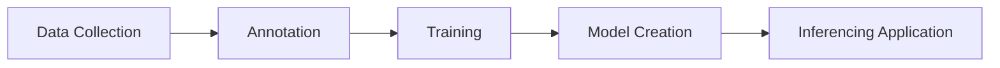

# Artificial Intelligence and Computer Vision

Workshop

  
    Press Space for next page <carbon:arrow-right class="inline"/>
  

  <!-- <button @click="$slidev.nav.openInEditor()" title="Open in Editor" class="text-xl slidev-icon-btn opacity-50 !border-none !hover:text-white">
    <carbon:edit />
  </button> -->
  <a href="https://github.com/antoniomtz/ai-cv-workshop" target="_blank" alt="GitHub" title="Open in GitHub"
    class="text-xl slidev-icon-btn opacity-50 !border-none !hover:text-white">
    <carbon-logo-github />
  </a>

<!--
The last comment block of each slide will be treated as slide notes. It will be visible and editable in Presenter Mode along with the slide. [Read more in the docs](https://sli.dev/guide/syntax.html#notes)
-->

---
transition: slide-left
---

# Outline

<ol>
  <li>Introduction of AI and CV</li>
  <li>AI and CV Basics</li>
  <li>Intel SW and HW</li>
  <li>Intel openVINO toolkit</li>
  <li>Hands-on with openVINO</li>
  <li>Questions</li>
</ol>    

<!--
You can have `style` tag in markdown to override the style for the current page.
Learn more: https://sli.dev/guide/syntax#embedded-styles
-->

<!--  -->

<!--
Here is another comment.
-->

---
transition: slide-left
---

# Table of contents

<Toc maxDepth="1"></Toc>

---
layout: cover
transition: slide-left
---
# Introduction of AI and CV

---
transition: slide-left
level: 2
---

# Use case: Intelligence queue management
 

  <video width="600" height="300" controls>
    <source src="/assets/intelligent-queue.mp4" type="video/mp4">
  </video>

---
layout: image-right
transition: slide-left
image: /assets/intel-ai-graphic.png
---

# Definitions

* **AI** involves teaching computers to process data in a way that **mimics the human brain**.
* **Computer Vision** is a field of AI that focuses on enabling computers to **interpret visual data**
* AI and CV are important in our lives for several reasons:
  * Automation
  * Healthcare
  * Safety
  * Customer experience

---
transition: slide-left
---
# Computer Vision Use Cases

  

    <ul>
      <li>Robotics</li>
      <li>Facial Recognition</li>
      <li>Object Detection</li>
      <li>Medical Imaging</li>
    </ul>
  

  

    
  

---
transition: slide-left
---
# Robotics Use Cases

* Self-driving Cars
  * Commercial vehicles
  * Delivery robots
* Surveillance robots
* Drones

  

  <iframe width="450" height="250" src="https://www.youtube.com/embed/kN0MLclnWa0?si=w1yJBFJ_IS81y-eo" title="YouTube video player" frameborder="0" allow="accelerometer; autoplay; clipboard-write; encrypted-media; gyroscope; picture-in-picture; web-share" allowfullscreen></iframe>

---
transition: slide-left
---
# Object Detection Use Cases

  

    <ul>
      <li>Retail:
        <ul>
          <li>Automated Self Checkout</li>
          <li>Inventory Magagement</li>
          <li>Customer Experience</li>
        </ul>
      </li>
      <li>Self-driving Vehicles:
        <ul>
          <li>Pedestrian detection</li>
          <li>Trees,cars,etc detection</li>
          <li>Lane detection</li>
        </ul>
      </li>
    </ul>
  

  

   <iframe width="350" height="200" src="https://www.youtube.com/embed/lEWFmKI5RYY?si=bsUWXxiUOfh4KId3" title="YouTube video player" frameborder="0" allow="accelerometer; autoplay; clipboard-write; encrypted-media; gyroscope; picture-in-picture; web-share" allowfullscreen></iframe>
    
   <iframe width="350" height="200" src="https://www.youtube.com/embed/3B8369neIHI?si=dpDsaq8x1yyDsv41" title="YouTube video player" frameborder="0" allow="accelerometer; autoplay; clipboard-write; encrypted-media; gyroscope; picture-in-picture; web-share" allowfullscreen></iframe>
  

---
transition: slide-left
---
# Facial Recognition Use Cases

* Facial Authentication
  * Buildings
  * Phones
* Criminal detection
  * Airports
  * Stores

  

  <iframe width="450" height="250" src="https://www.youtube.com/embed/SnH5qe8_rps?si=ym6M0GQGbs73GCzK" title="YouTube video player" frameborder="0" allow="accelerometer; autoplay; clipboard-write; encrypted-media; gyroscope; picture-in-picture; web-share" allowfullscreen></iframe>

---
transition: slide-left
---
# How does AI/CV work?
 
 
 
 
 

---
layout: center
class: text-center
---

# Learn More

[Documentations](https://sli.dev) · [GitHub](https://github.com/slidevjs/slidev) · [Showcases](https://sli.dev/showcases.html)
